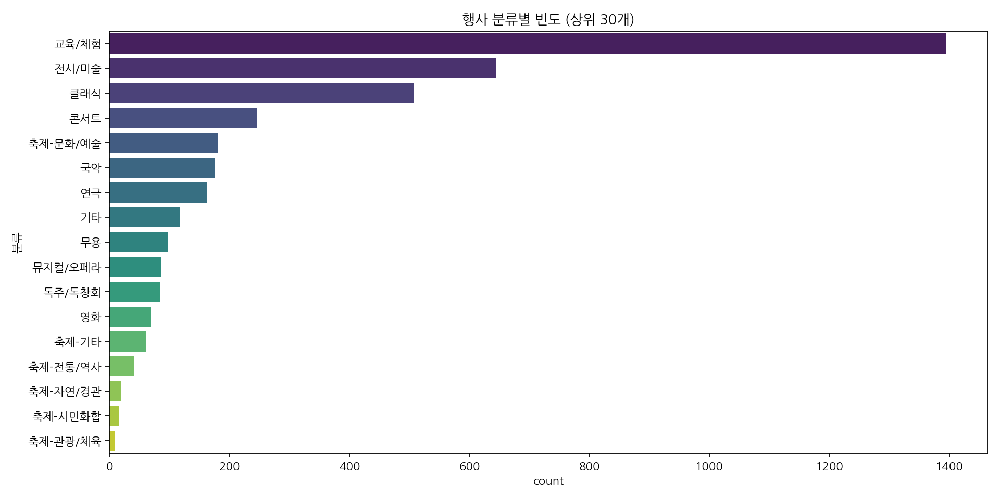
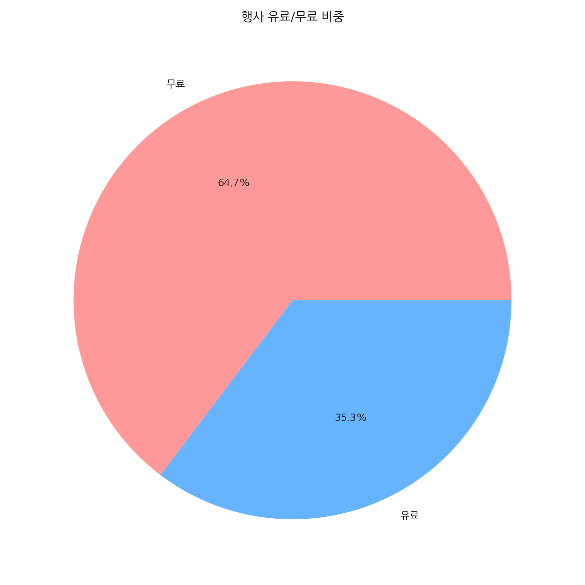
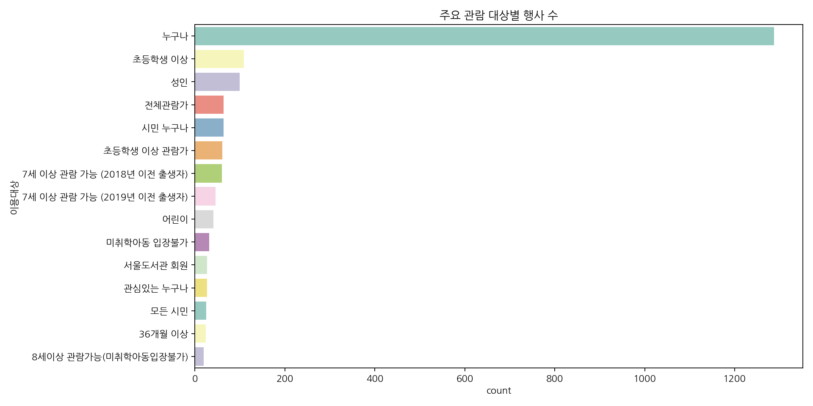
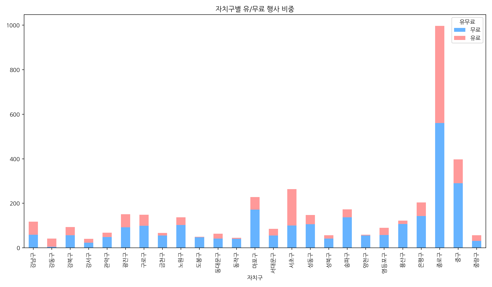
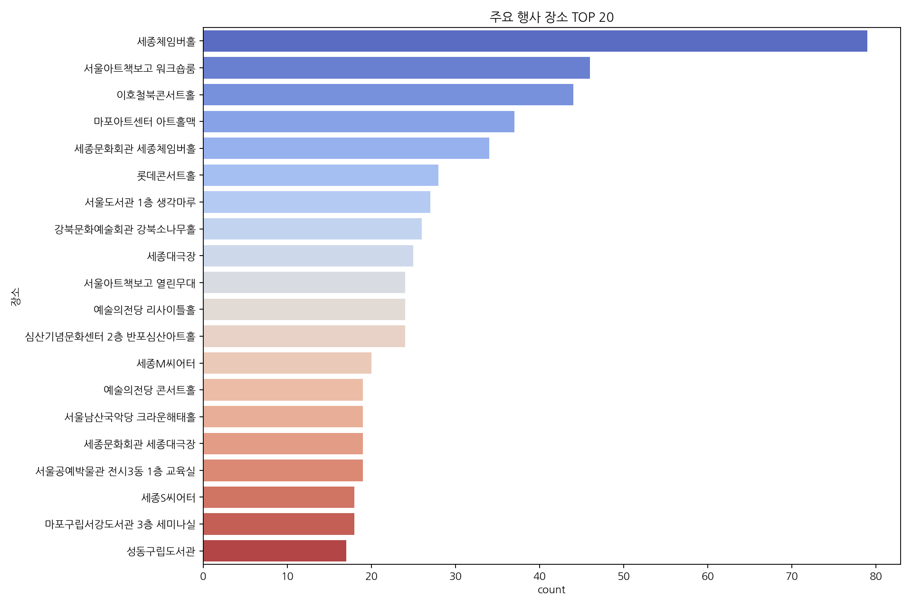
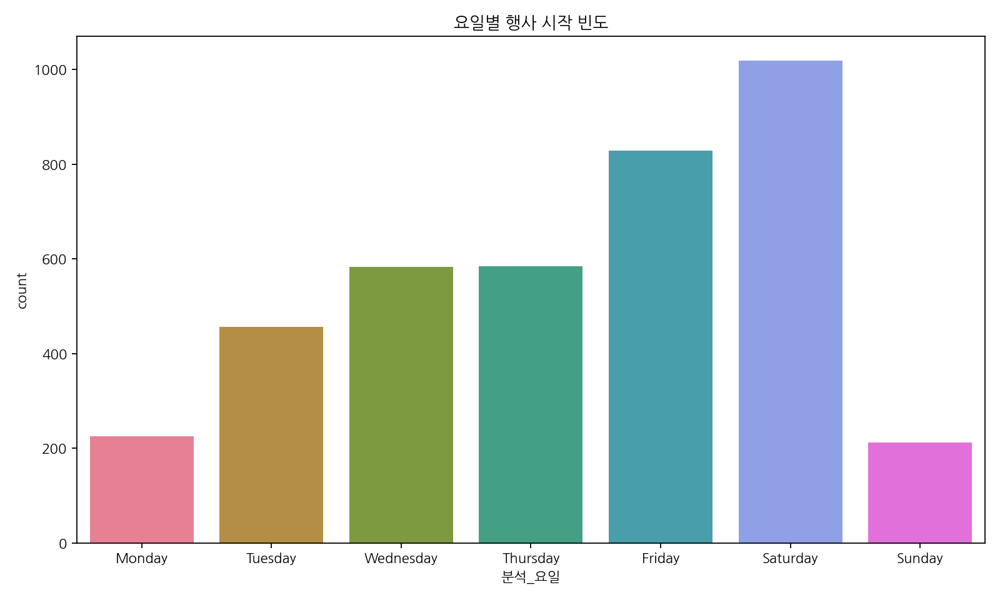
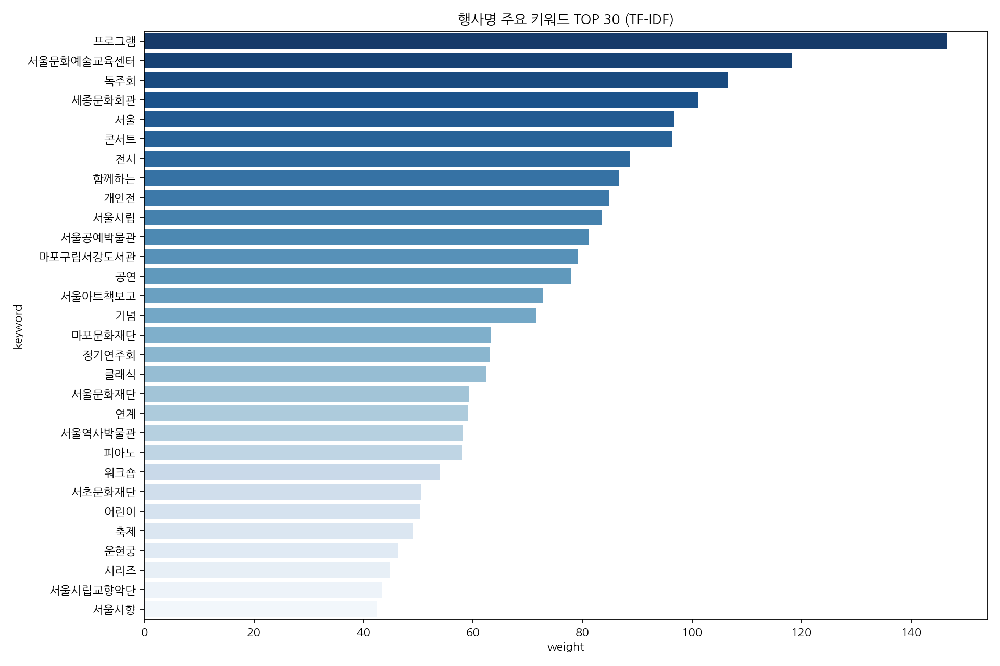

# 서울시 문화행사 정보 탐색적 데이터 분석(EDA) 보고서

## 1. 요약
본 보고서는 서울시에서 제공하는 문화행사 데이터를 바탕으로, Deco 앱의 초기 추천 콘텐츠 운영에 필요한 행사 분류, 지역별 분포, 비용 구조, 시계열 트렌드 및 핵심 키워드를 분석한 결과를 담고 있습니다.

## 2. 기초 데이터 정보
- **데이터 원천**: 로컬 CSV
- **전체 데이터 규모**: 3907건
- **컬럼 구성**: 분류, 자치구, 공연/행사명, 날짜, 장소, 기관명, 이용대상, 이용요금, 문의, 출연자정보, 프로그램소개, 기타내용, 홈페이지?주소, 대표이미지, 신청일, 시민/기관, 시작일, 종료일, 테마분류, 경도(Y좌표), 위도(X좌표), 유무료, 문화포털상세URL, 행사시간, 분석_시작일, 분석_종료일, 분석_월, 분석_요일, 분석_기간, 분석_기간분류
- **데이터 결측치 및 무결성**
전체 데이터 수: 3907행, 30열
중복 데이터 수: 0
주요 결측치:
|           |    0 |
|:----------|-----:|
| 분류        |    0 |
| 자치구       |    6 |
| 공연/행사명    |    0 |
| 날짜        |    0 |
| 장소        |    0 |
| 이용대상      |    0 |
| 이용요금      | 2126 |
| 유무료       |    0 |
| 테마분류      |    5 |
| 경도(Y좌표)   |    1 |
| 위도(X좌표)   |    1 |
| 문화포털상세URL |    0 |
| 행사시간      |    0 |

## 3. 기술통계 분석

### [범주형 변수 요약]
|        | 분류    | 자치구   | 공연/행사명    | 날짜                    | 장소     | 기관명   | 이용대상   | 이용요금   | 문의      | 출연자정보         | 프로그램소개      | 기타내용   | 홈페이지?주소                                                          | 대표이미지                                                                                                 | 신청일        | 시민/기관   | 시작일                   | 종료일                   | 테마분류   | 유무료   | 문화포털상세URL                                                                                      | 행사시간   | 분석_요일    | 분석_기간분류   |
|:-------|:------|:------|:----------|:----------------------|:-------|:------|:-------|:-------|:--------|:--------------|:------------|:-------|:-----------------------------------------------------------------|:------------------------------------------------------------------------------------------------------|:-----------|:--------|:----------------------|:----------------------|:-------|:------|:-----------------------------------------------------------------------------------------------|:-------|:---------|:----------|
| count  | 3907  | 3901  | 3907      | 3907                  | 3907   | 3907  | 3907   | 1781   | 3907    | 530           | 579         | 96     | 3907                                                             | 3907                                                                                                  | 3907       | 3907    | 3907                  | 3907                  | 3902   | 3907  | 3907                                                                                           | 3907   | 3907     | 3900      |
| unique | 17    | 25    | 3889      | 2071                  | 1980   | 95    | 1190   | 636    | 1416    | 506           | 530         | 82     | 3785                                                             | 3907                                                                                                  | 378        | 2       | 400                   | 465                   | 6      | 2     | 3907                                                                                           | 1825   | 7        | 3         |
| top    | 교육/체험 | 종로구   | 재능 혜화 마티네 | 2025-10-25~2025-10-25 | 세종체임버홀 | 기타    | 누구나    | 무료     | 홈페이지 참고 | (연주) 서울시립교향악단 | <html lang= | .      | https://museum.seoul.go.kr/cgcm/board/NR_boardList.do?bbsCd=1064 | https://culture.seoul.go.kr/cmmn/file/getImage.do?atchFileId=8dd93ec4c4874b809cf11b6fa5f4b6e8&thumb=Y | 2026-05-06 | 기관      | 2026-05-09 00:00:00.0 | 2025-09-27 00:00:00.0 | 기타     | 무료    | https://culture.seoul.go.kr/culture/culture/cultureEvent/view.do?cultcode=156698&menuNo=200009 | 19:30  | Saturday | 단기(3일이내)  |
| freq   | 1394  | 997   | 3         | 20                    | 79     | 900   | 1287   | 275    | 186     | 9             | 13          | 8      | 19                                                               | 1                                                                                                     | 33         | 3063    | 34                    | 42                    | 3253   | 2528  | 1                                                                                              | 317    | 1019     | 2169      |

### [수치형 변수 요약]
|       |      경도(Y좌표) |      위도(X좌표) | 분석_시작일                     | 분석_종료일                     |       분석_월 |     분석_기간 |
|:------|-------------:|-------------:|:---------------------------|:---------------------------|-----------:|----------:|
| count | 3906         | 3906         | 3907                       | 3907                       | 3907       | 3907      |
| mean  |  126.988     |   37.556     | 2025-11-10 11:46:10.719222 | 2025-12-01 07:35:33.094445 |    7.01792 |   21.826  |
| min   |  126.814     |   37.4364    | 2025-05-12 00:00:00        | 2025-03-08 00:00:00        |    1       | -268      |
| 25%   |  126.956     |   37.526     | 2025-08-09 00:00:00        | 2025-08-28 00:00:00        |    5       |    1      |
| 50%   |  126.984     |   37.5659    | 2025-11-01 00:00:00        | 2025-11-15 00:00:00        |    7       |    2      |
| 75%   |  127.022     |   37.5767    | 2026-02-22 12:00:00        | 2026-03-14 00:00:00        |   10       |   22      |
| max   |  127.17      |   37.6908    | 2026-08-13 00:00:00        | 2028-08-31 00:00:00        |   12       | 1044      |
| std   |    0.0645699 |    0.0435455 | nan                        | nan                        |    3.13499 |   49.8067 |

---

## 4. 상세 시각화 인사이트

### 행사 분류별 빈도 분석

**[분석 결과 및 인사이트]**
교육/체험, 전시/미술, 클래식처럼 데이트 테마로 전환하기 쉬운 장르가 어느 정도의 규모를 갖는지 확인하는 기본 분포입니다.

**[통계표]**
| 분류       |   count |
|:---------|--------:|
| 교육/체험    |    1394 |
| 전시/미술    |     644 |
| 클래식      |     508 |
| 콘서트      |     245 |
| 축제-문화/예술 |     180 |
| 국악       |     176 |
| 연극       |     163 |
| 기타       |     117 |
| 무용       |      97 |
| 뮤지컬/오페라  |      86 |

---

### 자치구별 행사 개최 현황

**[분석 결과 및 인사이트]**
종로구와 중구처럼 행사 밀도가 높은 지역은 초기 추천 코스의 거점으로 삼기 좋고, 낮은 지역은 보완 큐레이션이 필요합니다.

**[통계표]**
| 자치구   |   count |
|:------|--------:|
| 종로구   |     997 |
| 중구    |     397 |
| 서초구   |     264 |
| 마포구   |     228 |
| 은평구   |     204 |
| 송파구   |     173 |
| 광진구   |     151 |
| 구로구   |     149 |
| 성동구   |     147 |
| 노원구   |     137 |

---

### 행사 유료/무료 비중 분석

**[분석 결과 및 인사이트]**
원본의 유무료 컬럼을 기준으로 비용 접근성을 확인합니다. 무료 행사는 가성비 데이트 태그와 초기 유입 콘텐츠에 직접 활용할 수 있습니다.

**[통계표]**
| 유무료   |   count |
|:------|--------:|
| 무료    |    2528 |
| 유료    |    1379 |

---

### 월별 행사 개최 트렌드

**[분석 결과 및 인사이트]**
행사가 집중되는 월을 보면 시즌 기획과 추천 슬롯 운영 시점을 정할 수 있으며, 비수기에는 상설 전시형 콘텐츠를 보강해야 합니다.

**[통계표]**
|   분석_월 |   count |
|-------:|--------:|
|      1 |     165 |
|      2 |     151 |
|      3 |     252 |
|      4 |     367 |
|      5 |     491 |
|      6 |     366 |
|      7 |     343 |
|      8 |     317 |
|      9 |     426 |
|     10 |     321 |
|     11 |     400 |
|     12 |     308 |

---

### 관람 대상별 분포

**[분석 결과 및 인사이트]**
커플 데이트에 적합한 누구나, 성인, 청소년 이상 콘텐츠의 비중을 파악해 앱 추천 제외 조건과 우선 조건을 설계할 수 있습니다.

**[통계표]**
| 이용대상                       |   count |
|:---------------------------|--------:|
| 누구나                        |    1287 |
| 초등학생 이상                    |     109 |
| 성인                         |     100 |
| 전체관람가                      |      64 |
| 시민 누구나                     |      64 |
| 초등학생 이상 관람가                |      61 |
| 7세 이상 관람 가능 (2018년 이전 출생자) |      60 |
| 7세 이상 관람 가능 (2019년 이전 출생자) |      46 |
| 어린이                        |      41 |
| 미취학아동 입장불가                 |      32 |

---

### 자치구별 유/무료 행사 교차 분석

**[분석 결과 및 인사이트]**
지역별 무료 콘텐츠 규모를 비교하면 가성비 코스가 강한 자치구와 유료 공연 중심 자치구를 분리해 큐레이션할 수 있습니다.

**[통계표]**
| 자치구   |   무료 |   유료 |
|:------|-----:|-----:|
| 강남구   |   59 |   58 |
| 강동구   |    5 |   37 |
| 강북구   |   56 |   37 |
| 강서구   |   23 |   17 |
| 관악구   |   48 |   20 |
| 광진구   |   92 |   59 |
| 구로구   |   99 |   50 |
| 금천구   |   55 |   12 |
| 노원구   |  103 |   34 |
| 도봉구   |   47 |    3 |

---

### 주요 행사 장소 분석

**[분석 결과 및 인사이트]**
반복적으로 행사가 열리는 장소는 운영자가 장소 상세, 주변 이동 동선, 근처 카페를 미리 보강하기 좋은 거점입니다.

**[통계표]**
| 장소              |   count |
|:----------------|--------:|
| 세종체임버홀          |      79 |
| 서울아트책보고 워크숍룸    |      46 |
| 이호철북콘서트홀        |      44 |
| 마포아트센터 아트홀맥     |      37 |
| 세종문화회관 세종체임버홀   |      34 |
| 롯데콘서트홀          |      28 |
| 서울도서관 1층 생각마루   |      27 |
| 강북문화예술회관 강북소나무홀 |      26 |
| 세종대극장           |      25 |
| 서울아트책보고 열린무대    |      24 |

---

### 행사 기간 비중 분석

**[분석 결과 및 인사이트]**
단기 행사는 주말 추천에, 장기 행사는 홈 화면의 안정적인 상시 추천 콘텐츠에 배치하는 식으로 운영 전략을 나눌 수 있습니다.

**[통계표]**
| 분석_기간분류   |   count |
|:----------|--------:|
| 단기(3일이내)  |    2169 |
| 장기(15일이상) |    1284 |
| 중기(4-14일) |     447 |

---

### 요일별 행사 시작 현황

**[분석 결과 및 인사이트]**
금요일과 토요일 시작 행사의 규모를 보면 주말 데이트 푸시 알림, 홈 추천 갱신, 큐레이션 마감 시점을 정할 수 있습니다.

**[통계표]**
| 분석_요일     |   count |
|:----------|--------:|
| Monday    |     225 |
| Tuesday   |     456 |
| Wednesday |     583 |
| Thursday  |     584 |
| Friday    |     828 |
| Saturday  |    1019 |
| Sunday    |     212 |

---

### 핵심 키워드 분석 (TF-IDF)

**[분석 결과 및 인사이트]**
연도 숫자 같은 노이즈를 줄이고 실제 테마성 단어를 추출해 앱 태그 후보와 검색 필터 우선순위를 정하는 데 활용합니다.

**[통계표]**
| keyword    |   weight |
|:-----------|---------:|
| 프로그램       | 146.593  |
| 서울문화예술교육센터 | 118.163  |
| 독주회        | 106.438  |
| 세종문화회관     | 101.077  |
| 서울         |  96.8222 |
| 콘서트        |  96.3778 |
| 전시         |  88.5798 |
| 함께하는       |  86.6692 |
| 개인전        |  84.8724 |
| 서울시립       |  83.5503 |
| 서울공예박물관    |  81.0998 |
| 마포구립서강도서관  |  79.1847 |
| 공연         |  77.8814 |
| 서울아트책보고    |  72.7892 |
| 기념         |  71.4732 |
| 마포문화재단     |  63.2039 |
| 정기연주회      |  63.0849 |
| 클래식        |  62.4104 |
| 서울문화재단     |  59.1984 |
| 연계         |  59.0778 |

---

## 5. Deco Admin 운영 제언
- **초기 거점**: 종로구, 중구, 서초구, 마포구처럼 행사가 많은 지역을 중심으로 홈 추천 코스를 먼저 구성합니다.
- **태그 체계**: 무료, 전시, 체험, 공연, 야간처럼 원본 데이터에서 안정적으로 추출 가능한 태그를 1차 필터로 사용합니다.
- **주말 운영**: 금요일과 토요일 시작 행사를 기준으로 목요일 오후에 주말 추천 후보를 확정하는 운영 흐름이 적합합니다.
- **데이터 연결**: 생성된 `docs/data/recommendations.json` 파일은 Deco 앱 홈 추천, 상세 설명, 지도 후보 데이터의 초기 원천으로 활용할 수 있습니다.
