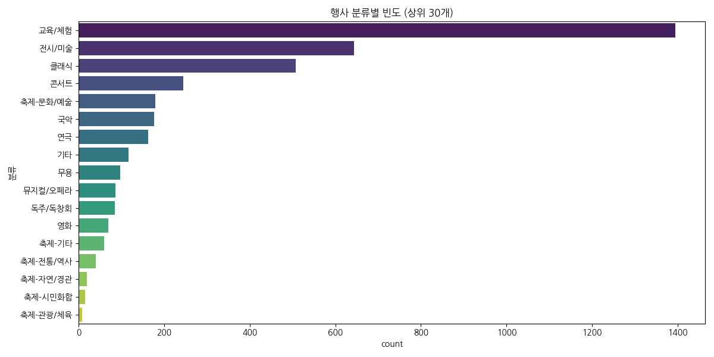
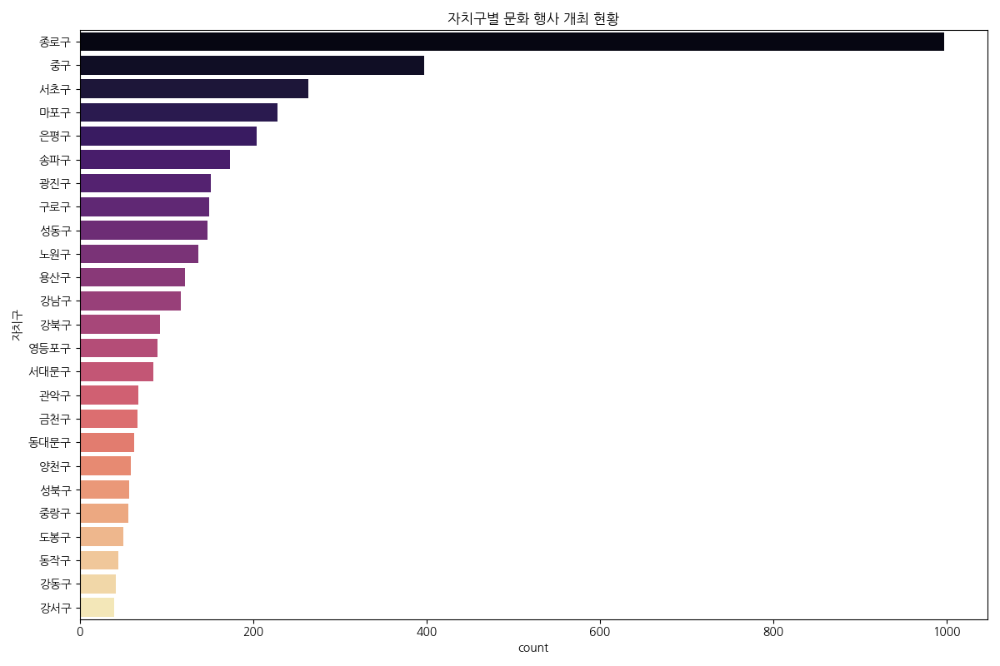
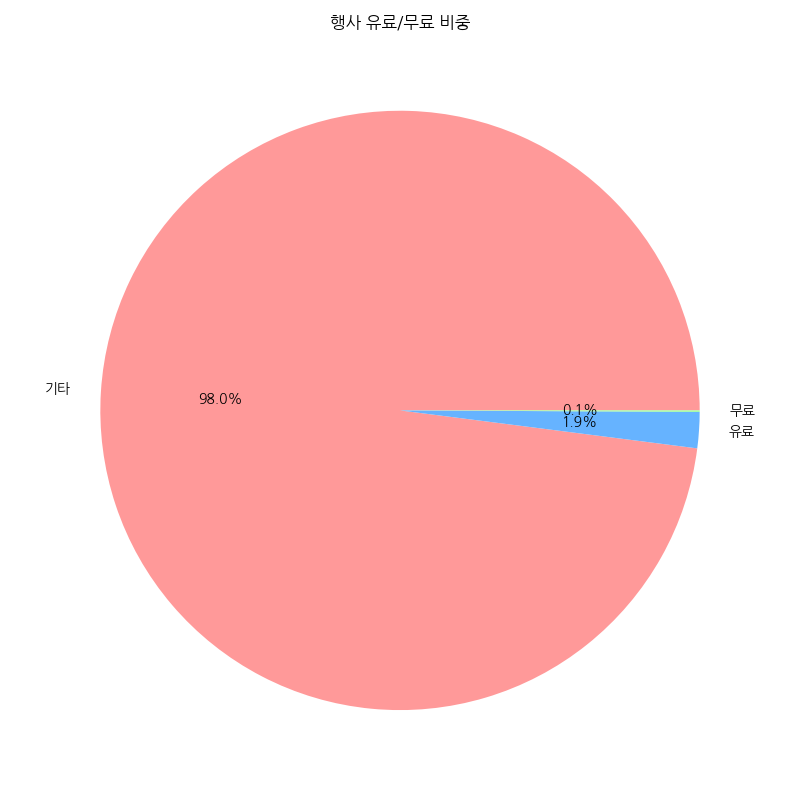
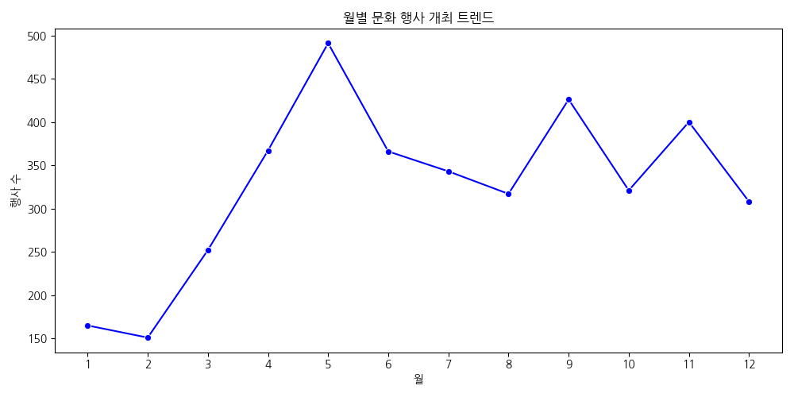
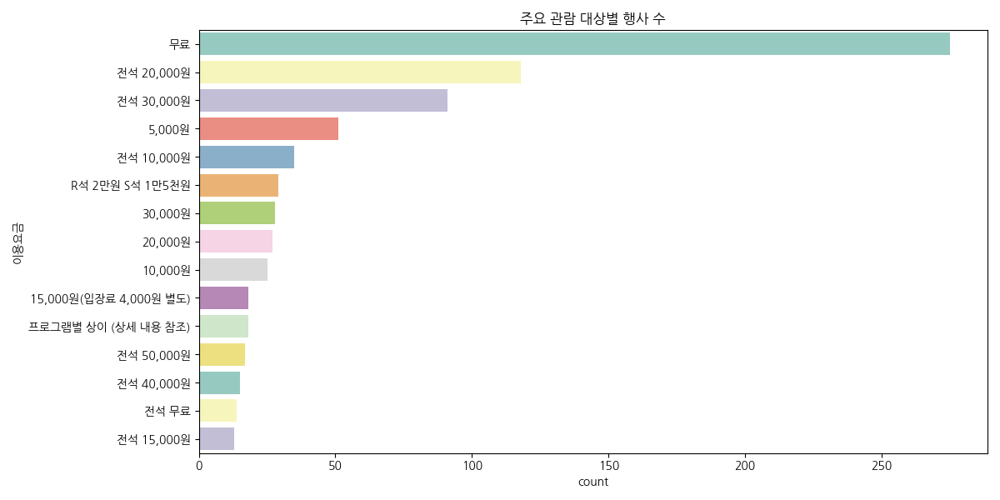
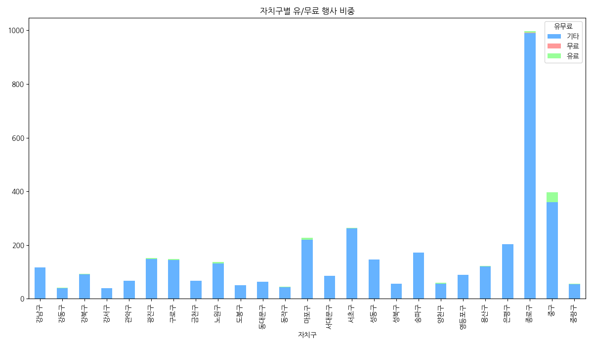
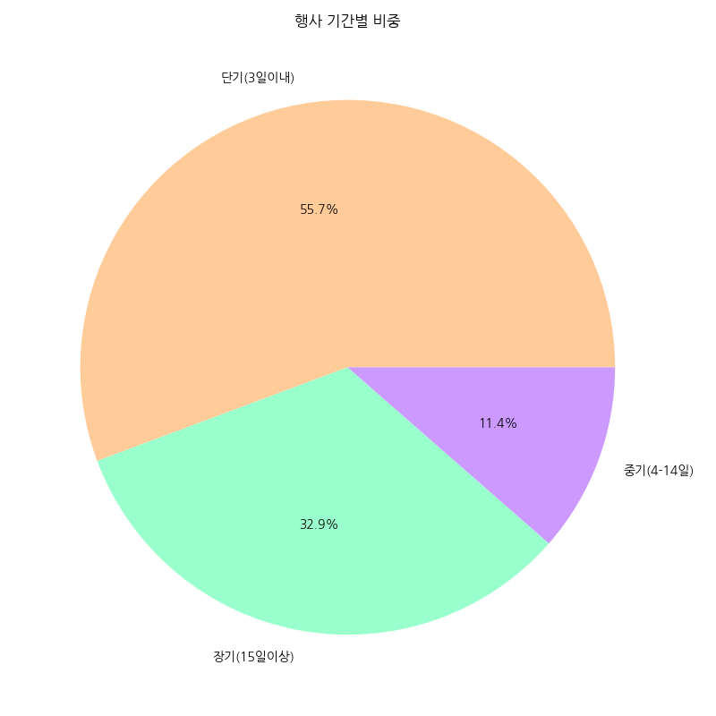
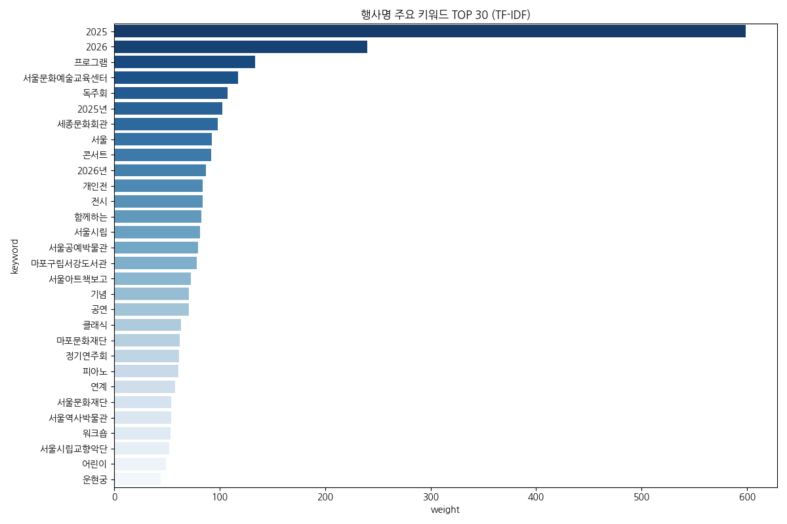

# 서울시 문화행사 정보 탐색적 데이터 분석(EDA) 보고서

## 1. 요약
본 보고서는 서울시에서 제공하는 문화행사 데이터를 바탕으로, 행사 분류, 지역별 분포, 비용 구조, 시계열 트렌드 및 핵심 키워드를 분석한 결과를 담고 있습니다.

## 2. 기초 데이터 정보
- **전체 데이터 규모**: 3907건
- **컬럼 구성**: 분류, 자치구, 공연/행사명, 날짜, 장소, 기관명, 이용대상, 이용요금, 문의, 출연자정보, 프로그램소개, 기타내용, 홈페이지?주소, 대표이미지, 신청일, 시민/기관, 시작일, 종료일, 테마분류, 경도(Y좌표), 위도(X좌표), 유무료, 문화포털상세URL, 행사시간
- **데이터 결측치 및 무결성**: 전체 데이터 수: 3907행, 24열
중복 데이터 수: 0

## 3. 기술통계 분석

### [범주형 변수 요약]
|        | 분류    | 자치구   | 공연/행사명    | 날짜                    | 장소     | 기관명   | 이용대상   | 이용요금   | 문의      | 출연자정보         | 프로그램소개      | 기타내용   | 홈페이지?주소                                                          | 대표이미지                                                                                                 | 신청일        | 시민/기관   | 시작일                   | 종료일                   | 테마분류   | 유무료   | 문화포털상세URL                                                                                      | 행사시간   |
|:-------|:------|:------|:----------|:----------------------|:-------|:------|:-------|:-------|:--------|:--------------|:------------|:-------|:-----------------------------------------------------------------|:------------------------------------------------------------------------------------------------------|:-----------|:--------|:----------------------|:----------------------|:-------|:------|:-----------------------------------------------------------------------------------------------|:-------|
| count  | 3907  | 3901  | 3907      | 3907                  | 3907   | 3907  | 3907   | 1781   | 3907    | 530           | 579         | 96     | 3907                                                             | 3907                                                                                                  | 3907       | 3907    | 3907                  | 3907                  | 3902   | 3907  | 3907                                                                                           | 3907   |
| unique | 17    | 25    | 3889      | 2071                  | 1980   | 95    | 1190   | 636    | 1416    | 506           | 530         | 82     | 3785                                                             | 3907                                                                                                  | 378        | 2       | 400                   | 465                   | 6      | 2     | 3907                                                                                           | 1825   |
| top    | 교육/체험 | 종로구   | 재능 혜화 마티네 | 2025-10-25~2025-10-25 | 세종체임버홀 | 기타    | 누구나    | 무료     | 홈페이지 참고 | (연주) 서울시립교향악단 | <html lang= | .      | https://museum.seoul.go.kr/cgcm/board/NR_boardList.do?bbsCd=1064 | https://culture.seoul.go.kr/cmmn/file/getImage.do?atchFileId=8dd93ec4c4874b809cf11b6fa5f4b6e8&thumb=Y | 2026-05-06 | 기관      | 2026-05-09 00:00:00.0 | 2025-09-27 00:00:00.0 | 기타     | 무료    | https://culture.seoul.go.kr/culture/culture/cultureEvent/view.do?cultcode=156698&menuNo=200009 | 19:30  |
| freq   | 1394  | 997   | 3         | 20                    | 79     | 900   | 1287   | 275    | 186     | 9             | 13          | 8      | 19                                                               | 1                                                                                                     | 33         | 3063    | 34                    | 42                    | 3253   | 2528  | 1                                                                                              | 317    |

### [수치형 변수 요약]
|       |      경도(Y좌표) |      위도(X좌표) |
|:------|-------------:|-------------:|
| count | 3906         | 3906         |
| mean  |  126.988     |   37.556     |
| std   |    0.0645699 |    0.0435455 |
| min   |  126.814     |   37.4364    |
| 25%   |  126.956     |   37.526     |
| 50%   |  126.984     |   37.5659    |
| 75%   |  127.022     |   37.5767    |
| max   |  127.17      |   37.6908    |

---

## 4. 상세 시각화 인사이트

### 행사 분류별 빈도 분석

**[분석 결과 및 인사이트]**
어떤 종류의 문화 행사가 가장 많이 개최되는지 확인할 수 있습니다. 대중적인 장르와 비주류 장르의 격차를 파악할 수 있는 지표입니다.

**[통계표]**
| 분류       |   count |
|:---------|--------:|
| 교육/체험    |    1394 |
| 전시/미술    |     644 |
| 클래식      |     508 |
| 콘서트      |     245 |
| 축제-문화/예술 |     180 |
| 국악       |     176 |
| 연극       |     163 |
| 기타       |     117 |
| 무용       |      97 |
| 뮤지컬/오페라  |      86 |

---

### 자치구별 행사 개최 현황

**[분석 결과 및 인사이트]**
서울시 내 자치구별 문화 인프라 및 행사 집중도를 시각적으로 나타냅니다. 특정 지역에 행사가 편중되어 있는지 확인할 수 있습니다.

**[통계표]**
| 자치구   |   count |
|:------|--------:|
| 종로구   |     997 |
| 중구    |     397 |
| 서초구   |     264 |
| 마포구   |     228 |
| 은평구   |     204 |
| 송파구   |     173 |
| 광진구   |     151 |
| 구로구   |     149 |
| 성동구   |     147 |
| 노원구   |     137 |

---

### 행사 유료/무료 비중 분석

**[분석 결과 및 인사이트]**
시민들이 무료로 접근할 수 있는 행사의 비율을 보여줍니다. 공공 문화 서비스의 접근성을 판단하는 주요 지표입니다.

**[통계표]**
| 유무료   |   count |
|:------|--------:|
| 기타    |    3828 |
| 유료    |      76 |
| 무료    |       3 |

---

### 월별 행사 개최 트렌드

**[분석 결과 및 인사이트]**
계절적 요인이 문화 행사 개최에 미치는 영향을 파악합니다. 특정 시기에 행사가 집중되는 경향을 확인할 수 있습니다.

**[통계표]**
|   월 |   count |
|----:|--------:|
|   1 |     165 |
|   2 |     151 |
|   3 |     252 |
|   4 |     367 |
|   5 |     491 |
|   6 |     366 |
|   7 |     343 |
|   8 |     317 |
|   9 |     426 |
|  10 |     321 |
|  11 |     400 |
|  12 |     308 |

---

### 관람 대상별 분포

**[분석 결과 및 인사이트]**
어린이, 청소년, 성인 등 누구를 타겟으로 하는 행사가 많은지 보여줍니다. 문화 복지의 수혜 대상을 분석할 수 있습니다.

**[통계표]**
| 이용요금                   |   count |
|:-----------------------|--------:|
| 무료                     |     275 |
| 전석 20,000원             |     118 |
| 전석 30,000원             |      91 |
| 5,000원                 |      51 |
| 전석 10,000원             |      35 |
| R석 2만원 S석 1만5천원        |      29 |
| 30,000원                |      28 |
| 20,000원                |      27 |
| 10,000원                |      25 |
| 15,000원(입장료 4,000원 별도) |      18 |

---

### 자치구별 유/무료 행사 교차 분석

**[분석 결과 및 인사이트]**
각 자치구가 제공하는 문화 서비스의 성격(공공성 vs 상업성)을 비교할 수 있습니다.

**[통계표]**
| 자치구   |   기타 |   무료 |   유료 |
|:------|-----:|-----:|-----:|
| 강남구   |  116 |    0 |    1 |
| 강동구   |   40 |    0 |    2 |
| 강북구   |   91 |    0 |    2 |
| 강서구   |   40 |    0 |    0 |
| 관악구   |   68 |    0 |    0 |
| 광진구   |  148 |    1 |    2 |
| 구로구   |  144 |    0 |    5 |
| 금천구   |   67 |    0 |    0 |
| 노원구   |  132 |    0 |    5 |
| 도봉구   |   50 |    0 |    0 |

---

### 주요 행사 장소 분석

**[분석 결과 및 인사이트]**
서울시 내에서 어떤 장소가 문화 행사의 거점 역할을 하고 있는지 확인합니다.

**[통계표]**
| 장소              |   count |
|:----------------|--------:|
| 세종체임버홀          |      79 |
| 서울아트책보고 워크숍룸    |      46 |
| 이호철북콘서트홀        |      44 |
| 마포아트센터 아트홀맥     |      37 |
| 세종문화회관 세종체임버홀   |      34 |
| 롯데콘서트홀          |      28 |
| 서울도서관 1층 생각마루   |      27 |
| 강북문화예술회관 강북소나무홀 |      26 |
| 세종대극장           |      25 |
| 서울아트책보고 열린무대    |      24 |

---

### 행사 기간 비중 분석

**[분석 결과 및 인사이트]**
일회성 단기 행사와 전시형 장기 행사의 비중을 보여줍니다.

**[통계표]**
| 기간분류      |   count |
|:----------|--------:|
| 단기(3일이내)  |    2176 |
| 장기(15일이상) |    1284 |
| 중기(4-14일) |     447 |

---

### 요일별 행사 시작 현황

**[분석 결과 및 인사이트]**
주말을 겨냥한 행사가 금요일이나 토요일에 얼마나 집중되는지 알 수 있습니다.

**[통계표]**
| 요일        |   count |
|:----------|--------:|
| Monday    |     225 |
| Tuesday   |     456 |
| Wednesday |     583 |
| Thursday  |     584 |
| Friday    |     828 |
| Saturday  |    1019 |
| Sunday    |     212 |

---

### 핵심 키워드 분석 (TF-IDF)

**[분석 결과 및 인사이트]**
행사 제목에서 가장 빈번하게 등장하는 단어들을 통해 서울시 문화 행사의 전반적인 테마를 파악합니다.

**[통계표]**
|    | keyword    |   weight |
|---:|:-----------|---------:|
|  0 | 2025       | 598.493  |
|  2 | 2026       | 240.179  |
| 27 | 프로그램       | 133.938  |
| 12 | 서울문화예술교육센터 | 117.463  |
|  7 | 독주회        | 107.571  |
|  1 | 2025년      | 102.495  |
| 18 | 세종문화회관     |  98.5311 |
| 10 | 서울         |  92.5377 |
| 25 | 콘서트        |  92.1879 |
|  3 | 2026년      |  86.8363 |
|  4 | 개인전        |  84.2207 |
| 23 | 전시         |  83.8309 |
| 29 | 함께하는       |  82.8322 |
| 14 | 서울시립       |  81.4061 |
| 11 | 서울공예박물관    |  79.4339 |
|  8 | 마포구립서강도서관  |  78.1353 |
| 16 | 서울아트책보고    |  72.669  |
|  6 | 기념         |  70.9642 |
|  5 | 공연         |  70.6727 |
| 26 | 클래식        |  63.5963 |

---

## 5. 결론 및 제언
- **지역적 편중**: 특정 자치구에 행사가 집중되어 있는 경향이 확인되었습니다. 문화 소외 지역에 대한 인프라 확충이 필요합니다.
- **다양한 타겟층**: 전 연령대를 대상으로 하는 행사가 많으나, 특정 취약 계층이나 정교한 타겟팅을 가진 행사의 비중을 높일 필요가 있습니다.
- **무료 행사의 가치**: 높은 무료 행사 비중은 시민들의 문화 향유 기회를 확대하는 긍정적인 요소입니다.
- **계절성 고려**: 월별 트렌드에 따라 행사 개최 시기를 조정하여 방문객 분산 및 활성화를 도모할 수 있습니다.
